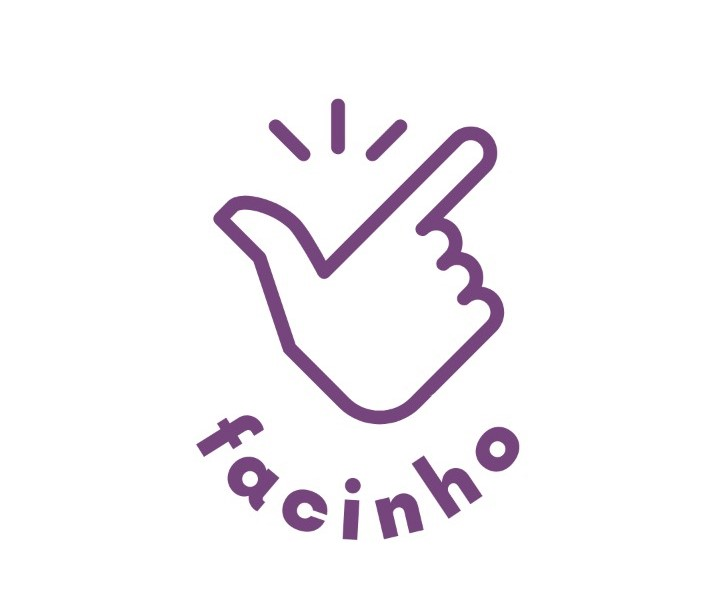
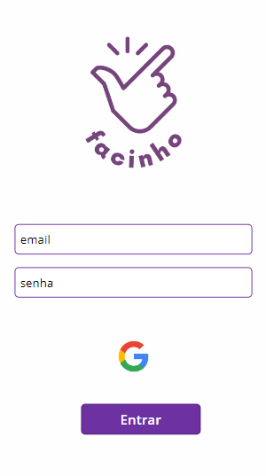

<div id="top"></div>

<!-- PROJECT LOGO -->
<br />
<div align="center">
  <a href="https://github.com/othneildrew/Best-README-Template">
    
  </a>
  <h1 align="center">Facinho</h1>
  <h3 align="center">
    Simplificando a vida do empreendedor!
  </h3>
</div>


## Sobre o Projeto
<div align="center">

</div>

Projeto desenvolvido sob iniciativa do Hackathon ofertado pelo Ânima Lab HUB, a área de TI & Computação do Ecossistema Ânima e o PMI (Project Management Institute) em parceria com a Gerando Falcões.

Trata-se de um desafio em que os alunos utilizaram recursos da Microsoft Power Hub Tool através do PMI, para soluções de apoio às favelas assistidas pela Gerando Falcões, a partir de um case de exemplo de empreendedores dessas comunidades. 

A partir desse programa piloto, conseguimos nos capacitar para obter
o PMI Citizen Development e Microsoft Certification, além do apoio à comunidade através do impacto social.

## Como Utilizar

Para excecutar o PowerApps, siga os passos abaixo:

1. Clone o repositorio:
   ```sh
   git clone https://github.com/chalestristian/facinho.git
   ```
2. Acesse e logue com seu usuário:
   ```sh
   https://powerapps.microsoft.com/
   ```
3. Clique em: Criar.

4. Clique em: Aplicativo em branco.

5. Coloque o nome do seu projeto.

6. Selecione o tipo de tela: Telefone.

7. Clique em: Arquivo.

8. Clique em: Abrir.

9. Clique em: Procurar.

10. Selecione o arquivo clonado com o nome abaixo e clique em abrir:
   ```sh
   facinhov2vivi.msapp.zip
   ```